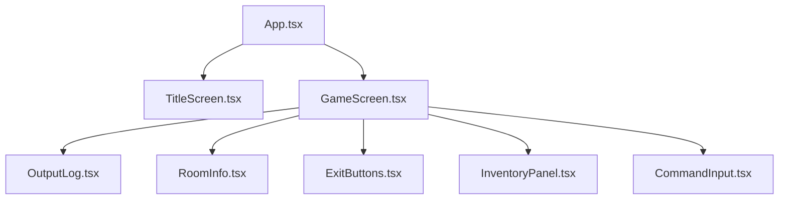
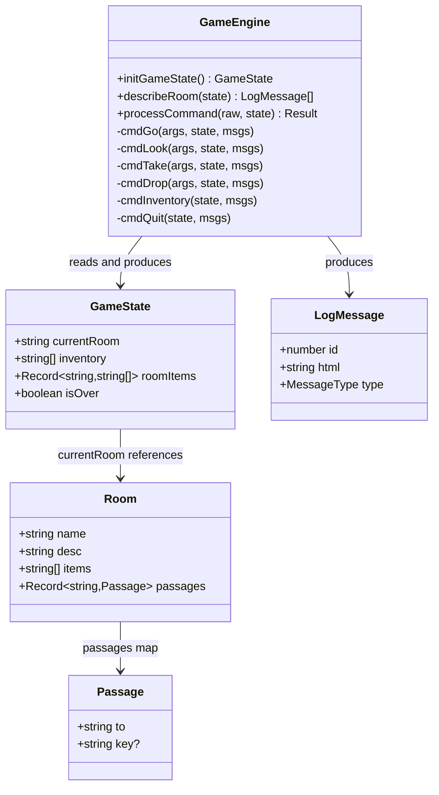
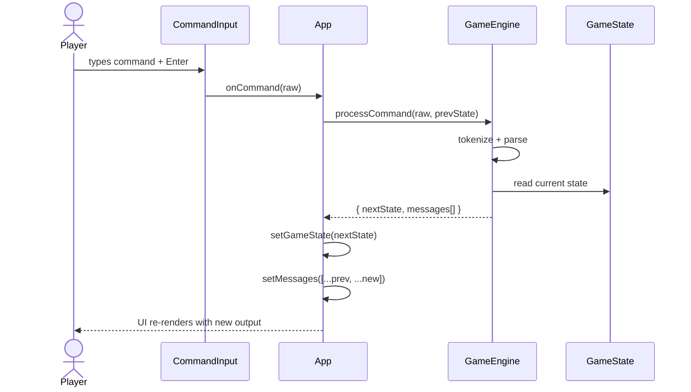
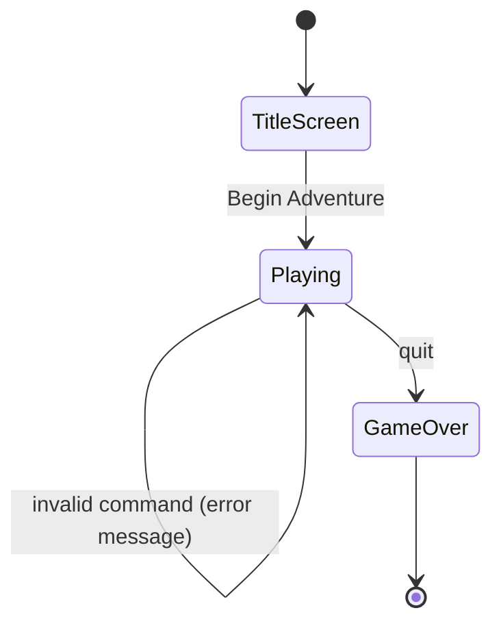
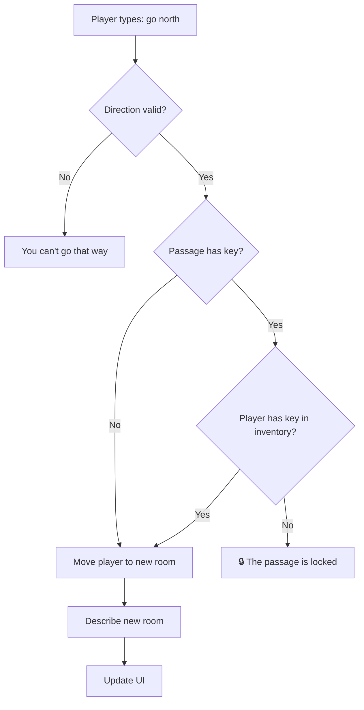

# 🎃 ZOOrk: Halloween at Hilltop Manor

A web-based text adventure game built with React, TypeScript, Vite, and DaisyUI — ported from a C++ university assignment. Explore a haunted manor, collect keys, unlock locked doors, and uncover the secrets of Hilltop Manor.

**Live Demo:** [zoork-web.vercel.app](https://zoork-web.vercel.app) _(update with your URL)_

---

## ✨ Features

- 10 interconnected rooms to explore
- Key-based locked door system
- Full command parser (go, look, take, drop, inventory, quit)
- Clickable exit buttons with lock indicators
- Clickable inventory badges with item descriptions
- Spooky halloween UI theme with custom fonts
- Fully typed with TypeScript
- Runs on Deno with Vite

---

## 🛠 Tech Stack

| Layer        | Technology                                    |
| ------------ | --------------------------------------------- |
| Runtime      | Deno                                          |
| Bundler      | Vite 5                                        |
| UI Framework | React 18 + TSX                                |
| Styling      | Tailwind CSS v4 + DaisyUI 5 (halloween theme) |
| Language     | TypeScript                                    |
| Deployment   | Vercel                                        |

---

## 🗺 Room Map

```
                    [ Garden ]
                        |
                        | north
                        |
[ Basement ] --up-- [ Kitchen ] --west-- [ Hallway ] --west(🔒black-key)-- [ Library ]
                                              |
                                         north(🔒pumpkin-key)
                                              |
                                         [ Bedroom ] --east-- [ Bathroom ]
                                              |         |
                                             up      west(🔒witch-key)
                                              |         |
                                          [ Attic ]  [ Study ]

[ Foyer ] --north(🔒orange-key)--> [ Hallway ]
```

---

## 🏗 Architecture

### Component Tree



### Class Diagram



### Command Processing Flow



### Game State Machine



### Door / Passage Logic



---

## 📁 File Structure

```
zoork/
├── deno.json                   # Deno tasks and compiler options
├── package.json                # npm dependencies
├── vite.config.ts              # Vite + React plugin config
├── tsconfig.json               # TypeScript config
├── postcss.config.js           # PostCSS + Tailwind v4
├── index.html                  # Entry HTML (data-theme="halloween")
└── src/
    ├── main.tsx                # React root mount
    ├── App.tsx                 # Root component, game state owner
    ├── index.css               # Tailwind + DaisyUI + custom styles
    ├── types.ts                # Shared TypeScript interfaces
    ├── data/
    │   ├── rooms.ts            # All 10 rooms, passages, and items
    │   └── items.ts            # Item descriptions
    ├── engine/
    │   └── GameEngine.ts       # Pure command processor (no side effects)
    └── components/
        ├── TitleScreen.tsx     # Start screen with tutorial toggle
        ├── GameScreen.tsx      # Main game layout
        ├── OutputLog.tsx       # Scrolling message history
        ├── RoomInfo.tsx        # Exits + items info bar
        ├── ExitButtons.tsx     # Clickable direction buttons
        ├── InventoryPanel.tsx  # Clickable inventory badges
        └── CommandInput.tsx    # Text input + submit
```

---

## 🚀 Getting Started

**Prerequisites:** [Deno](https://deno.com) installed

```bash
# Clone the repo
git clone https://github.com/Abdullah-The-Great/Zoork-web.git
cd Zoork-web

# Install dependencies
deno install

# Start dev server
deno task dev
```

Open [http://localhost:5173](http://localhost:5173)

---

## 🎮 How to Play

| Command             | Action                    |
| ------------------- | ------------------------- |
| `go north` / `go n` | Move in a direction       |
| `look`              | Describe current room     |
| `look <item>`       | Examine a specific item   |
| `take <item>`       | Pick up an item           |
| `drop <item>`       | Drop an item              |
| `inventory` / `inv` | List what you're carrying |
| `quit`              | Exit the game             |

**Tips:**

- All 7 keys start in the Foyer — take the right one before heading to a locked door
- Click exit buttons to move without typing
- Click inventory badges to inspect items
- Locked doors show a 🔒 on their exit button

---

## 🔑 Key & Door Reference

| Key           | Door              |
| ------------- | ----------------- |
| `orange-key`  | Foyer ↔ Hallway   |
| `black-key`   | Hallway ↔ Library |
| `pumpkin-key` | Hallway ↔ Bedroom |
| `witch-key`   | Bedroom ↔ Study   |

---

## 🧱 Design Decisions

**Pure game engine** — `GameEngine.ts` is a pure function with no side effects. It takes state in and returns new state + messages out. This makes it trivially testable and keeps all React concerns in the components.

**Immutable state** — every command returns a new `GameState` object via spread. No mutation anywhere.

**HTML messages** — log messages are stored as HTML strings to allow colored item names inline in output text. `dangerouslySetInnerHTML` is used only on engine-generated strings, never user input.

---

## 📦 Building for Production

```bash
deno task build
```

Output goes to `dist/`. Deploy by pushing to `main` — Vercel auto-deploys.

---

## 👤 Author

**Abdullah Mehboob** — [GitHub](https://github.com/Abdullah-The-Great)
